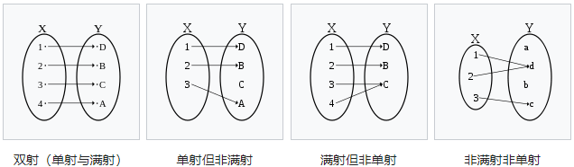

# 史怀济《数学分析》学习笔记

《数学分析》，史怀济，中国科学大学，视频：共220讲，[B站视频链接](https://www.bilibili.com/video/av18844091)

> 因为此文件包含大量的公式，如果：
>
> * 你在GitHub online查看，建议使用Chrome配合Chrome插件[MathJax Plugin for Github](https://chrome.google.com/webstore/detail/mathjax-plugin-for-github/ioemnmodlmafdkllaclgeombjnmnbima?hl=en)以便查看排版后的LaTeX
> * 你下载此Repo源文件到本地，建议使用[Typora](https://support.typora.io)并开启([Inline Math](https://support.typora.io/Math/#inline-math))后查看。

<!-- TOC depthFrom:1 depthTo:6 withLinks:1 updateOnSave:1 orderedList:0 -->

- [史怀济《数学分析》学习笔记](#史怀济数学分析学习笔记)
	- [第一章 实数和数列极限](#第一章-实数和数列极限)
		- [1.1 实数](#11-实数)
			- [问题1.1](#问题11)
			- [问题1.2](#问题12)
		- [1.2 数列和收敛数列](#12-数列和收敛数列)
		- [1.3 收敛数列的性质](#13-收敛数列的性质)
		- [1.4 数列极限的推广](#14-数列极限的推广)
		- [1.5 单调数列](#15-单调数列)
		- [1.6 自然对数的底 e](#16-自然对数的底-e)
		- [1.7 基本列和Cauchy收敛原理](#17-基本列和cauchy收敛原理)
		- [1.8上确界和下确界](#18上确界和下确界)
		- [1.9 有限覆盖定理](#19-有限覆盖定理)
		- [1.10 上极限和下极限](#110-上极限和下极限)
		- [1.11 Stolz定理](#111-stolz定理)
	- [第二章 函数的连续性](#第二章-函数的连续性)
		- [2.1 集合的映射](#21-集合的映射)
	- [参考](#参考)

<!-- /TOC -->

## 第一章 实数和数列极限

### 1.1 实数

#### 问题1.1

**1. 非负整数 $a$, $b$ 使得 $\frac{a^2 + b^2}{ab + 1}$为整数，求证这个整数必是某一个整数的平方。**

方法一（反证法、[韦达跳跃](https://zh.wikipedia.org/wiki/%E9%9F%8B%E9%81%94%E8%B7%B3%E8%BA%8D)）：

令
$$
k = \frac{a^2 + b^2}{ab + 1}
$$

- 假设存在一个或更多不是完全平方数的解 $k$ 。
- 对特定 $k$ ，$(x, y) = (A,B)$ 是方程 $x^2 + y^2 - mxy = 0$ 正整数解对。
- 由于 $x^2 + y^2 - mxy - m = 0$ 是关于 x,y 对称的方程，先设 $A \ge B$。
- 再设原整数方程关于 $A$ 的二次方程，即为：$x^2 + b_1^2 - kBx- m = 0$，$x = A$ 是其中一个正整数根。利用[韦达定理](https://zh.wikipedia.org/wiki/%E9%9F%8B%E9%81%94%E5%AE%9A%E7%90%86)，可将另一根表示成$x_2 = kB - A$或是$x_2 = \frac{B^2 – k}{A}$。
- 从 $x_2$的第一个表示式可得$x_2$为整数，第二个表示式可得$x_2 \neq 0$，因为$k$不是完全平方数。进一步，从$\frac{x_2^2 + b^2}{x_2B+1}=k>0$可得$x_2$为正整数。
- 最后，从$A>B$可推出$x_2=\frac{B^2-k}{A}<A$，所以$x_2 + B < A + B$，与$A + B$为最小矛盾。

方法二（[无穷递降法](https://www.zhihu.com/question/60664582)）：

令 $k = \frac{a^2 + b^2}{ab + 1}$
1. 当 $a = b$时，
  - $k = \frac{2a^2}{a^2 + 1} = (2 - k)a^2 > 0$，即： $2 - k > 0, k \in (0, 2)$，因为$k$是整数，那么 $k = 1$
2. 当 $a \neq b$，设 $a > b$，则
  - $k = \frac{a^2 + b^2}{ab + 1} > \frac{a^2 + b^2}{a^2 + 1} > 1$
  - 根据题目条件，得到$a^2 - bka + b^2 - k = 0$, 且该方程必有正整数根 $a$。设另一根为 $a_1$。得到
    - $a^2 - bka + b^2 - k = 0, \tag{1}$
    - $a_1^2 - bka_1 + b^2 - k = 0, \tag{2}$
  - $(1), (2)$两式相减及相加（其实这是[韦达定理](https://zh.wikipedia.org/wiki/%E9%9F%A6%E8%BE%BE%E5%AE%9A%E7%90%86)），可以得到
    - $a + a_1 = bk, \tag{3}$
    - $b^2 - k = a a_1, \tag{4}$
    - 根据题目定义，$b, k$ 是整数，所以 $a_1$是整数。
  - 接着证明 $a_1$ 的正负性：
    - 设 $a_1 \leq -1$, 则 $(a_1^2 + b^2) = k(a_1b + 1) \leq k(-b + 1) \leq 0$ 不成立，所以 $a_1 \ge 0$。
    - 所以 $0 \leq a_1 = \frac{b^2 - k}{a} < \frac{b^2}{a} < b < a$
    - 如果 $a_1 = 0$，那么$k$为平方数，所以只用讨论 $0 < a_1 < b < a$的情况
- 对 $k = \frac{a^2 + b^2}{ab + 1}$重复上面的推理，可知存在整数$b_1$满足 $b > a_1 > b_1 \ge 0$，使得 $k = \frac{a_1^2 + b_1^2}{a_1b_1 + 1}$
- 这样回到了原来的情况，不过这时有 $a > b > a_1 > b_1$
- 上述过程可以无限循环，最后必然有一个 $a_i = 0$ 或 $b_i = 0$。不论任何情况，$k$都是一个平方数。

#### 问题1.2

**2.若$a_1 \leq a_2 \leq \cdots \leq a_n$，$b_1 \leq b_2 \leq \cdots \leq b_n$，证明Tchebycheff不等式**：
$$
\sum_{i=1}^n a_i \sum_{i=1}^n b_i  \leq n\sum_{i=1}^n a_i b_i
$$

证明：

由[排序不等式](https://zh.wikipedia.org/wiki/%E6%8E%92%E5%BA%8F%E4%B8%8D%E7%AD%89%E5%BC%8F)可知，最大的和为顺序和：$a_1b_1+ \cdots + a_nb_n$

因此有：
- $a_1b_1 + a_2b_2+ \cdots + a_nb_n = a_1b_1+ a_2b_2+ \cdots + a_nb_n$
- $a_1b_1 + a_2b_2+ \cdots + a_nb_n \ge a_1b_2 + a_2b_3 + \cdots + a_nb_1$
- $a_1b_1 + a_2b_2+ \cdots + a_nb_n = a_1b_3 + a_2b_4 +  \cdots + a_nb_2$
- $\vdots$
- $a_1b_1+ a_2b_2 + \cdots + a_nb_n \ge a_1b_n + a_2b_1 + \cdots + a_nb_{n-1}$

将这$n$个不等式分边相加，同时对右边进行因式分解，便得到：

$n(a_1b_1 + a_2b_2+ \cdots + a_nb_n) \ge (a_1 + a_2 + a_3 + \cdots + a_n)(b_1 + b_2+ \cdots + b_n)$
两边同时处于$n$，即证明了命题。

### 1.2 数列和收敛数列

例四里用到 **几何平均-算术平均不等式**:

$$ \sqrt[n]{x_1 x_2 \cdots x_n} \leq \frac{x_1 + x_2 + \cdots + x_n}{n} $$

### 1.3 收敛数列的性质

练习题 1.3 第3、4、5题

### 1.4 数列极限的推广

练习题 1.4 第3题

### 1.5 单调数列

练习题 1.5 第1题

### 1.6 自然对数的底 e

对于

$$
e_n = \left(1 + \frac{1}{n}\right)^n
$$

是单调递增数列，并且有上界。

证明用到二项式定理有：
$$
e_n = 1 + \sum_{k=1}^n \binom{n}{k} \frac{1}{n^k}
$$

自然对数 $e$ :
$$
e = \lim_{n\rightarrow \infty} \left(1+\frac{1}{1!}+\frac{1}{2!}+\cdots+\frac{1}{n!}\right)
$$
练习题 1.6 第2题

### 1.7 基本列和Cauchy收敛原理

**基本列的定义**：设$\{a_n\}$是一列实数列。对任意给定的$\epsilon>0$，若存在$N\in N^*$，使得当$m, n\in N^*$且$m,n>N$时，有 $|a_m-a_n|<\epsilon$

数列收敛的充分必要条件是，数列是基本列。

**引理**：从任一数列中必可取出一个单调子列。

**定理** Bolzano-Weierstrass定理：从任何有界的数列中必可选出一个收敛的子列。

**定理**：一个数列收敛的充分必要条件是它是基本列。

### 1.8上确界和下确界

**定义1.8.1**：设$E$为一非空的有上界的集合，实数$\beta$满足一下两个条件：

* 对任何$x \in E$，有$x \leq \beta$；
* 对任意给定的$\epsilon >0$，必可找到一个$x_\epsilon \in E$，使得$x_\epsilon > \beta - \epsilon$

这时，称$\beta$为集合$E$的**上确界**，记作$\beta = \mathbb{sup} E$。

**定义1.8.2**：设$E$为一非空的有上界的集合，实数$\alpha$满足一下两个条件：

- 对任何$x \in E$，有$x \geq \alpha$；
- 对任意给定的$\epsilon >0$，必可找到一个$_y\epsilon \in E$，使得$x_\epsilon < \alpha + \epsilon$

这时，称$\alpha$为集合$E$的**下确界**，记作$\alpha = \mathbb{inf} E$。

**定理1.8.1**：非空的有上界的集合必有上确界；非空的有下界的集合必有下确界。

### 1.9 有限覆盖定理

**定义1.9.1**：如果$A$是实数集，$\mathscr{J}=\left\{I_{\lambda}\right\}$是一个开区间族，其中$\lambda \in \Lambda$，这里的$\Lambda$称为指标集。如果
$$
A \subset \bigcup_{\lambda \in \Lambda} I_{\lambda}
$$
称开区间族$\{ I_\lambda \}$是$A$的一个**开覆盖**，或者说$\{I_\lambda\}$盖住了$A$。

$\mathscr{J}=\left\{I_{\lambda}\right\}$是$A$开覆盖也可以等价叙述为：任取 $a \in A$，总有$\mathscr{J}$中的一个成员，记为$I_{\lambda(a)}$，使得$a \in I_{\lambda(a)}$。

**定理1.9.1（紧致性定理）**：设$[a, b]$是一个有限闭区间，并且它有一个开覆盖$\{ I_\lambda \}$，那么从这个开区间族中必可选取有限个成员（开区间）来，这有限个开区间所成的族任事$[a, b]$的开覆盖。也称为**有限覆盖定理**、**Heine-Borel定理**。

### 1.10 上极限和下极限

**定义1.10.1**：设$\{a_n\}$是一个数列，$E$是由$\{a_n\}$的全部极限点构成的集合。记
$$
a^{\space*}=\sup E, \quad a_{\space*}=\inf E
$$
$a^{\space*}, a_{\space*}$分别称为数列$\{a_n\}$的**上极限**和**下极限**，记为
$$
\limsup _{n \rightarrow \infty} a_{n}, \quad \liminf _{n \rightarrow \infty} a_{n}
$$
**定理1.10.1**：设$\{a_n\}$是一个数列，$E$和$a^*$的定义同前，那么：

* $a^* \in E$；
* 若$x > a^*$，则存在$N \in N^*$，使得当$n \geq N$时，有$a_n < x$；
* $a^*$是满足前两条性质的唯一数。

**定理1.10.2**：设$\{a_n\}$，$\{b_n\}$是两个数列：

* $\liminf _{n \rightarrow \infty} a_{n} \leq\limsup _{n \rightarrow \infty} a_{n}$；
* $\lim_{n \rightarrow \infty} a_{n}=a$当且仅当$\liminf _{n \rightarrow \infty} a_{n} = \limsup _{n \rightarrow \infty} a_{n} = a$；
* 若$N$是某个正整数，当$n>N$时，$a_n \leq b_n$，那么

$$
\liminf _{n \rightarrow \infty} a_{n} \leq\liminf _{n \rightarrow \infty} b_{n}, \quad \limsup _{n \rightarrow \infty} a_{n} \leq\limsup _{n \rightarrow \infty} b_{n}
$$

**定理1.10.3**：对于数列$\{a_n\}$，定义$\alpha_n=\inf_{k\geq n}a_k$, $\beta_n = \sup_{k \geq n} a_k$，那么：

* $\{\alpha_n\}$是递增数列，$\{\beta_n\}$是递减数列；
* $\lim_{n\rightarrow \infty}\alpha_n = a_*$, $\lim_{n\rightarrow \infty}\beta_n = a^*$。

### 1.11 Stolz定理

**定理1.11.1** $\left(Stolz, \frac{\infty}{\infty}型\right)$：设$\{b_n\}$是严格递增且趋于$+\infty$的数列。如果
$$
\lim _{x \rightarrow \infty} \frac{a_{n}-a_{n-1}}{b_{n}-b_{n-1}}=A
$$
那么
$$
\lim _{n \rightarrow \infty} \frac{a_{n}}{b_{n}}=A
$$
其中$A$可以是$+\infty$或者$-\infty$。

## 第二章 函数的连续性

### 2.1 集合的映射

**定义 2.1.1**：设$A, B$s是两个集合，如果$f$是一种规律，使得对$A$中的每一个元素$x$，$B$中唯一确定的元素——记作$f(x)$——与$x$对应，则称$f$是一个$A$到$B$的**映射**，用
$$
f: A \rightarrow B
$$
来表示。集合$A$叫作映射$f$的**定义域**；$f(x) \in B$叫作$x$在映射$f$之下的**像**或$f$在$x$的**值**。

**定义2.1.2**：**相等**：设$f: A \rightarrow B$，且$g: A \rightarrow B$。如果对任何$x \in A$，均有$f(x) = g(x)$，则称映射$f$与$g$**相等**，记为$f=g$。

**定义2.1.3**：**满射**：设$f: A \rightarrow B$，如果$f(a)=B$，则称$f$是从$A$到$B$上的**满射**，也就是说，$B$中的任何元素都是$A$中某一元素在$f$之下的像。

**定义2.1.4**：**单射**：设$f: A \rightarrow B$，如果当$x, y \in A$，且$x \neq y$时，有$f(x) \neq f(y)$，则称$f$为**单射**。

**定义2.1.5**：**一对一**：设$f: A \rightarrow B$，既是单射又是满射，则称映射$f$是**一对一**的，这时，也说$f$在集合$A$与$B$之间建立一个**一一对应**。

**定义2.1.6**：设$f : A \rightarrow B, f \subset B$，则$A$的子集
$$
f^{-1}(F) = \{x \in A: f(x) \in F\}
$$
叫做$F$的**原像**。

**定义2.1.7**：设映射$f : B \rightarrow C$，映射$g$的定义域为$A$。当$x \in A_1=g^{-1}(B)$时，定义映射
$$
f \circ g(x) = f(g(x))
$$
显然，$f \circ g : A_1 \rightarrow C$，称为映射$f$和$g$的**复合**。

### 2.2 集合的势

设$A$与$B$两个集合，如果存在一个从$A$到$B$的一对一映射，称集合$A$与$B$有相同的“**势**”或有相同的“**基数**”，称$A$与$B$**等价**。用$A \sim B$表示。这种关系具有以下性质：

* 自反性：$A \sim A$
* 对成性：$A \sim B$且$B \sim A$
* 传递性：若$A \sim B$且$B \sim C$，则$A \sim C$

**定义2.2.1**：令$N^*$为正整数的全体，且 $N_{n}=\{1,2, \cdots, n\}$.

* **有限集**：如果存在一个正整数$n$，使得集合$A \sim N_{n}$，那么$A$叫做**有限集**。
* **无限集**：如果集合$A$不是有限集，则称$A$为无限集。
* **可数集**：若$A \sim N_{n}$，则称$A$为可数集。
* **不可数集**：若$A$既不是有限集，也不是可数集，则称$A$为**不可数集**。
* **至多可数**：若$A$是有限集或者$A$是可数集，则称$A$是**至多可数**的。

**定理2.2.1**：可数集$A$的每一个无限子集是可数集。

**定理2.2.3**：$\mathbb{R}$中的全体有理数是可数的。

**定理2.2.4**：$[0, 1]$上的全体实数是不可数的。

## 参考

1. [数学学习小组](https://github.com/yuerYDP/Math_learning_group)

[回到顶部](#史怀济数学分析学习笔记)
